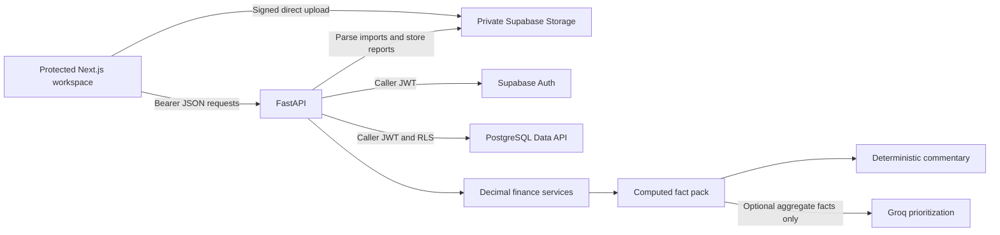

# Architecture

The repository deploys two services inside one Vercel project. The root
`vercel.json` routes `/api/*` to Python FastAPI and every other path to Next.js.
The shared origin keeps production browser/API requests simple.

## Authentication and ownership

Next.js server pages verify claims through Supabase SSR cookies; Proxy refreshes
sessions. Client API requests read the current session and attach a bearer token.
FastAPI asks Supabase Auth to verify that token. All data/Storage requests use the
same caller JWT and publishable key. Owner filters, parent checks, RLS, private
bucket policies, and composite foreign keys isolate users. No service-role key.

## Imports

Reserve metadata → browser uploads directly using signed capability → complete
verifies stored size → process claims a token/lease, downloads bounded private
bytes, parses CSV/XLSX, and commits derived rows and status in one database
transaction. Validation failure inserts no partial rows. Retries cannot add the
same derived rows twice. Separate processed imports are additive.

## Finance and reports

Pure Decimal variance and forecast functions underpin all pages, dashboard,
insights, and Excel reports. Scenarios copy and transform planned cash rows.
Cash snapshots are used directly; no implicit roll-forward occurs. APIs serialize
money as strings. Source/date/status rules are in [finance methodology](finance-methodology.md).

Insights hash facts and parameters for private caching. Optional Groq selects
existing fact/action IDs; the backend renders every figure. Provider failure falls
back. Report generation uses openpyxl in a thread pool, uploads private XLSX bytes,
records status, and creates five-minute signed URLs only on download requests.

## Operational boundaries

These are bounded synchronous request flows, not a job queue. Storage/database
cleanup is retryable but not a shared transaction. Report reads are not one
point-in-time snapshot. Tests use mocked upstream services; authenticated live
checks are recorded separately. See [security](../SECURITY.md),
[API](api.md), and [deployment](deployment.md).
